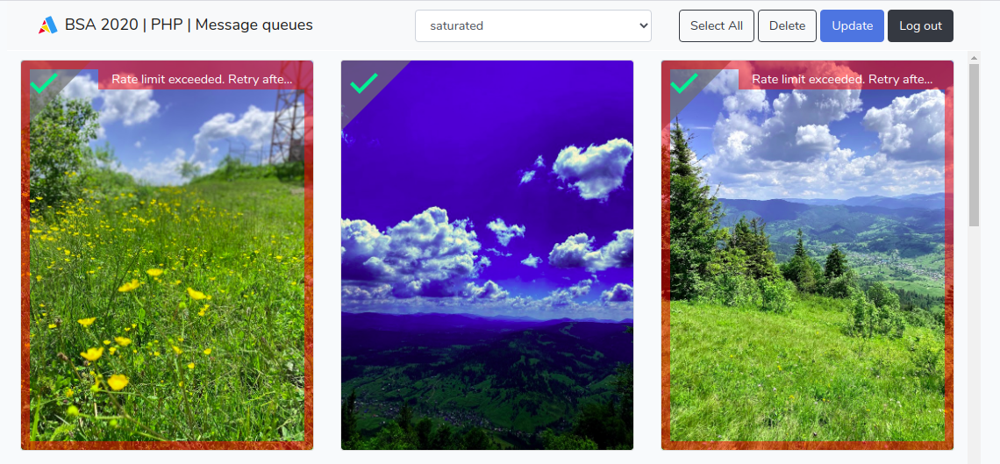

# Binary Studio Academy 2022

## Message Queues in Laravel

### Требования

Это задание направлено на работу c очередью сообщений и уведомлениями в Laravel.

***



### Задание

Есть нестабильное API, которое накладывает фильтры на изображения.
Ваша задача внедрить очередь сообщений для стабилизации его работы.

Для этого:

1) Настройте очередь сообщений beanstalk.

2) Добавьте джобу `ImageJob`, которая будет:

- Накладывать фильтр, при помощи сервиса `ImageApiService`

- Отправлять пуш-уведомление с обработанным изображением

- Обновлять изображение без перезагрузки страницы

- Отправлять пользователю e-mail с текстом, в случае неудачной обработки:

```html
Dear <user name>,

The applying the filter "<filter name>" was failed to the image:

<a href="<image url>"></a>

Best regards,
Binary Studio Academy
```

### Установка приложения

```bash

cp .env.example .env

docker-compose up -d
docker-compose run --rm composer install
docker-compose exec app php artisan key:generate
docker-compose exec app php artisan migrate
docker-compose run --rm frontend npm install

```

### Использование

Для запуска вам необходимо запустить приложение:

```bash
docker-compose up -d
```

И запустить frontend часть:

```bash
docker-compose run --rm -p 3000:3000 frontend npm run hot
```

После этого приложение будет доступно по адресу: [http://localhost:8000](http://localhost:8000)

### Шаги выполнения:

1) Настройте очередь сообщений `beanstalkd` в Laravel.

*Tip*: В предоставленном Docker окружении beanstalkd сервер уже установлен. Имейте ввиду, что внутри контейнера имя хоста соответствует имени сервиса в docker-compose (т.е. hostname = 'beanstalk'). Также учтите, что PHP библиотека для работы с beanstalkd не предустановлена. 

2) Добавьте джобу `App\Jobs\ImageJob`

3) С помощью сервиса `App\Services\ImageApiService` примените фильтр к переданному изображению

4) Создайте уведомления:

- `App\Notifications\ImageProcessedNotification` - для отправки пуш уведомления со статусом `success` и изображением.

```json
{
    "status": "success",
    "image": {
        "id": <image id>,
        "src": <image url>
    }
}
```

- `App\Notifications\ImageProcessingFailedNotification` - для отправки пуш уведомления со статусом `failed` и сообщением об ошибке. А также отправкой e-mail сообщения пользователю.

```json
{
    "status": "failed",
    "message": <error message>,
    "image": {
        "id": <image id>,
        "src": <image url>
    }
}
```

*Tip*: Для отправки e-mail сообщений используйте `log` драйвер. Отправленные сообщения можно будет найти в `storage/logs/`

5) В файле `resources/js/components/App.vue`:

- добавьте подписку на уведомления, используя библиотеку Echo

- В обработчике с успешным выполнением, необходимо принять id и url изображения, и обновить его методом `updateImageById`

- В обработчике с неуспешным выполнением, необходимо установить ошибку соответствующему изображению.

*Tip*: в текущем приложении логика для уведомлений выполняется в `then` и `catch` метода `updateImage()`

6) Запустите очередь сообщений с 1 попыткой и убедитесь, что часть изображений обработалось с ошибкой.

Если все сделано правильно, то должна быть красная рамка вокруг изображения, для неуспешно обработанных, и наложенный фильтр для успешно обработанных изображений.

В `storage/logs/laravel.log` должен быть текст e-mail сообщения и call-stack выброшенных исключений.

7) Проверьте наличие зафейлиных джоб

```bash
docker-compose exec app php artisan queue:failed
```

8) Перезапустите очередь сообщений с 3 попытками

9) Запустите зафейленные джобы заново

```
docker-compose exec app php artisan queue:retry all
```

Разрешается, и в некоторых местах это необходимо, редактирование исходного кода, кроме кода тестов.

### Проверка

Вам необходимо склонировать этот репозиторий, выполнить задание, запушить на bitbucket и прислать ссылку на репозиторий в личном кабинете.

__Форкать репозиторий запрещено!__

Проверяться задание будет по следующим критериям:

1) Тесты выполняются успешно: 5 баллов

2) Изображения обновляются без перезагрузки страницы, в случае ошибки статус изображения изменяется на странице: 3 балла

3) Очередь сконфигурирована так, что достаточно скопировать .env.example в .env и запустить очередь, чтобы все заработало: 1 балл

4) Код написан чисто и аккуратно в соответствии со стандартом [PSR-12](https://www.php-fig.org/psr/psr-12/), без комментариев в коде, без функций отладки: 1 балл

__изменять тесты запрещено!__

Чтобы проверить себя, вы можете запустить тесты командой:

```bash
docker-compose exec app ./vendor/bin/phpunit
```

### Miscellaneous

Заготовка для frontend части дана и находится в директории `resources/js/`.

Необходимые библиотеки предустановлены (`laravel-echo`, `socket.io`, `axios`) и настроены в файле `resources/js/bootstrap.js`.

Websocket-сервер также установлен и настроен.

Полезные комманды:

```bash
docker-compose run --rm composer require ... # установка composer зависимостей
docker-compose run --rm frontend npm install ... # установка npm зависимостей
docker-compose logs -f websocket ... # лог веб-сокет сервереа
```

### Полезные ссылки

- [Репозиторий с лекции](https://github.com/lenchv/bsa2019.queue)

- [Laravel. Queues](https://laravel.com/docs/8.x/queues)

- [Laravel. Notifications](https://laravel.com/docs/8.x/notifications)

- [Laravel. Broadcasting](https://laravel.com/docs/8.x/broadcasting)

